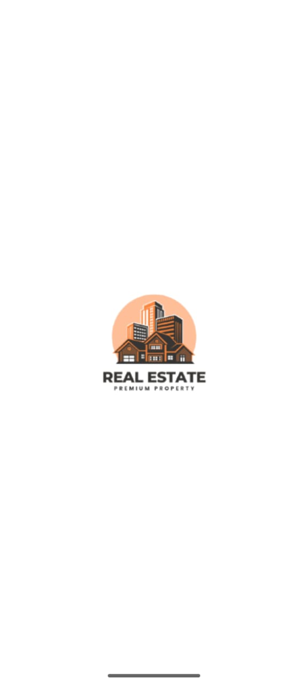
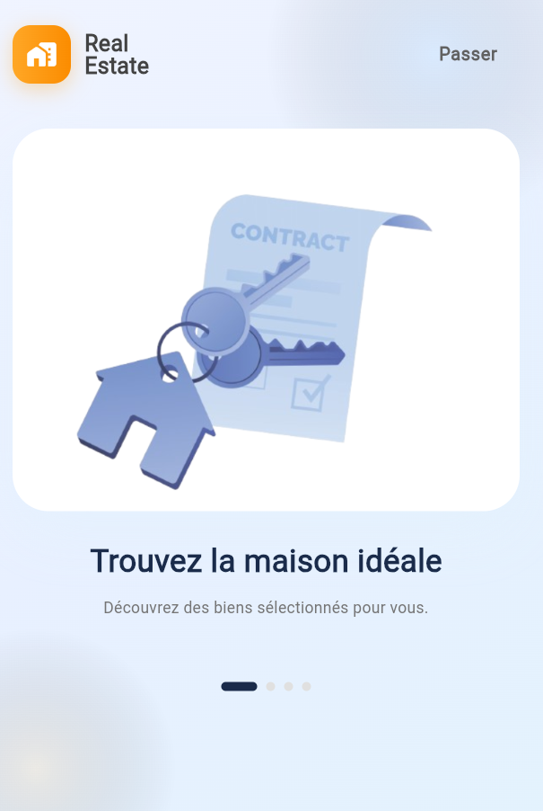
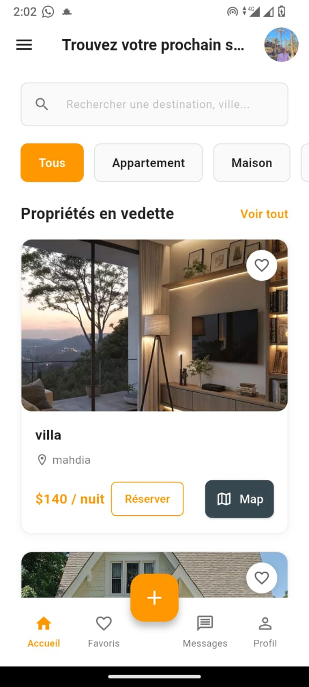
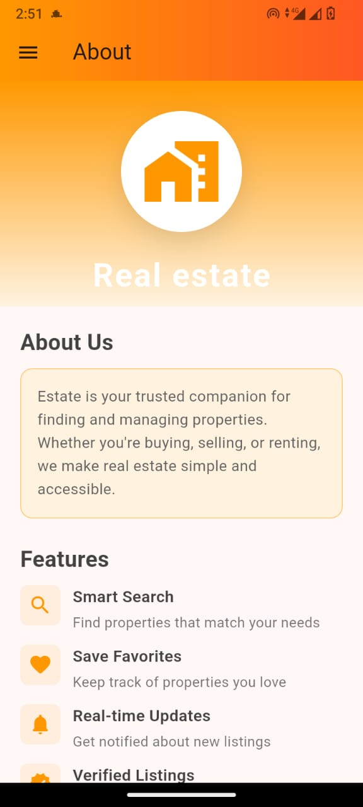
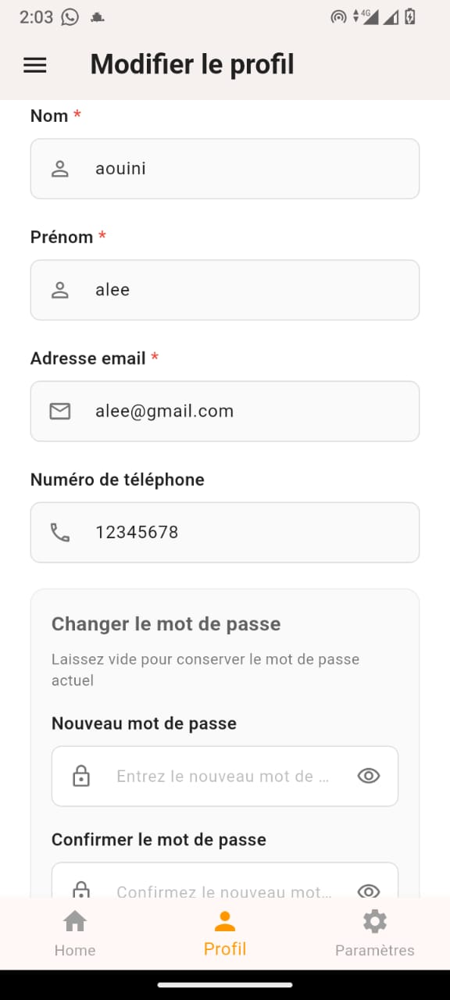
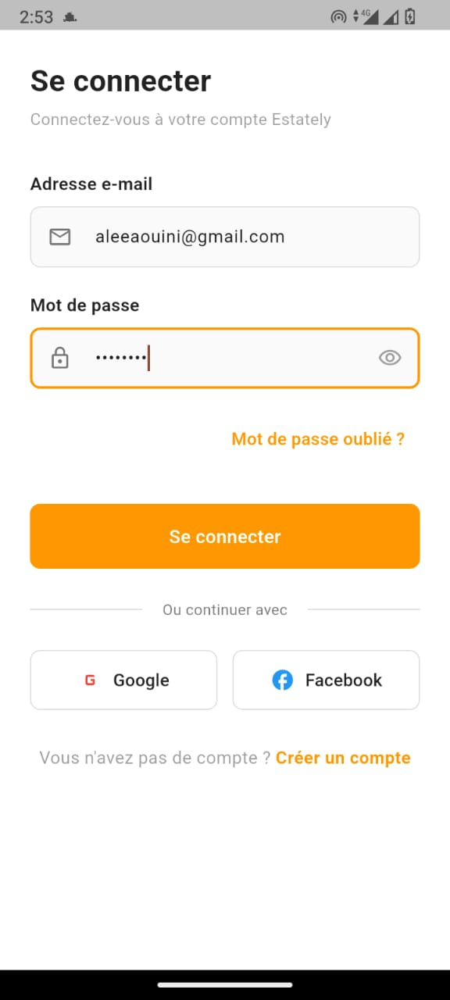
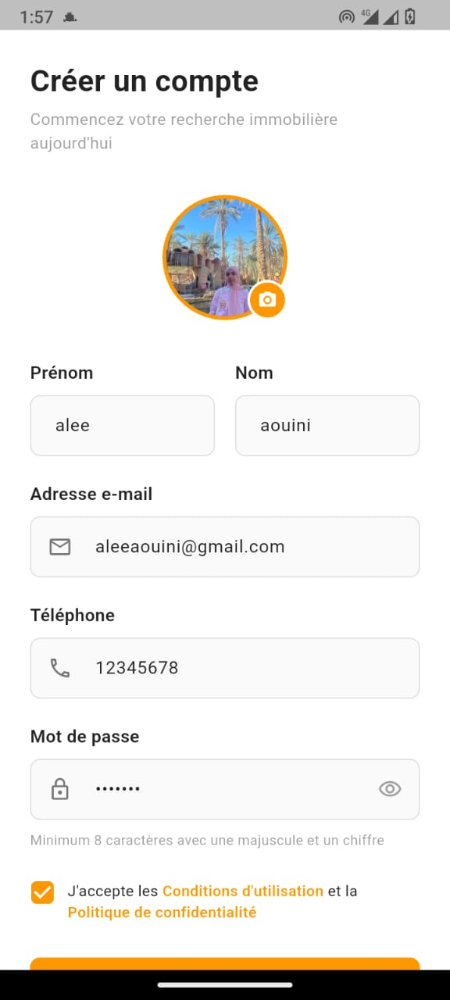
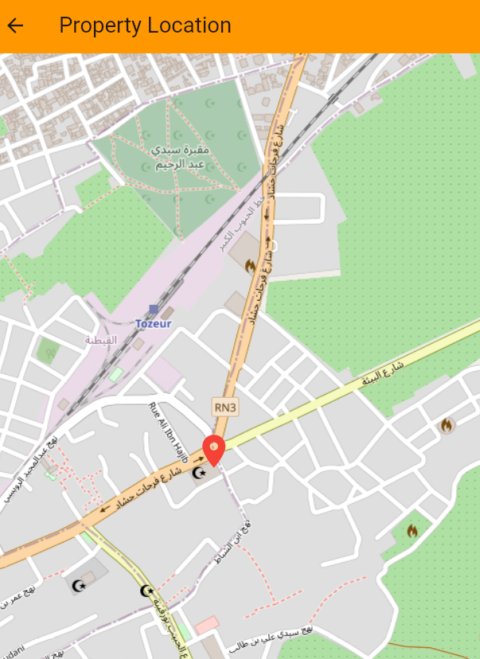
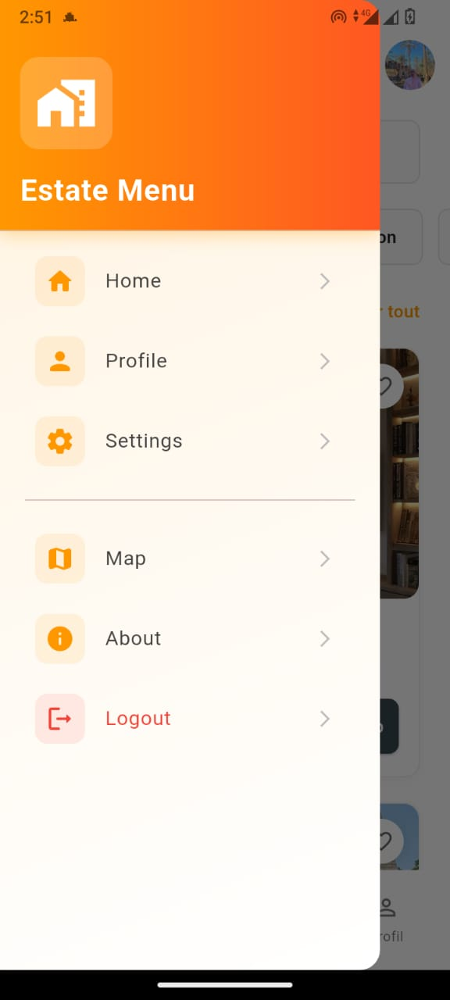

# 📱 Real Estate Mobile App – Flutter + Node.js

## 🏡 Description
This mobile application allows users to search, view, and publish real estate listings.  
It includes authentication, an interactive map, favorites management, user profiles, and communication between users.

---

## 🛠️ Technologies Used

### Frontend (Mobile App)
- Flutter (Dart)  
- Flutter Map + OpenStreetMap  

### Backend
- Node.js  
- Express.js  
- MongoDB  
- bcrypt (password hashing)  

---

## 🚀 Features

### 👤 User System
- Sign up / Log in  
- Profile management  

### 🏘️ Real Estate Listings
- View list of properties  
- View property details (price, description, photos, location…)  
- Add new property (publish an announcement)  
- Edit / delete own announcements  

### ❤️ Favorites
- Add/remove favorites  
- Favorites stored & displayed to the user  

### 🗺️ Map Integration
- Interactive map with Flutter Map + OpenStreetMap  
- View property location  

### 💬 Communication
- User-to-user messaging (if implemented)  

---

## 📸 Screenshots

  
  
  
  
  
  
  
  
  
  
  
  
  
  

---

## 📂 Project Structure

